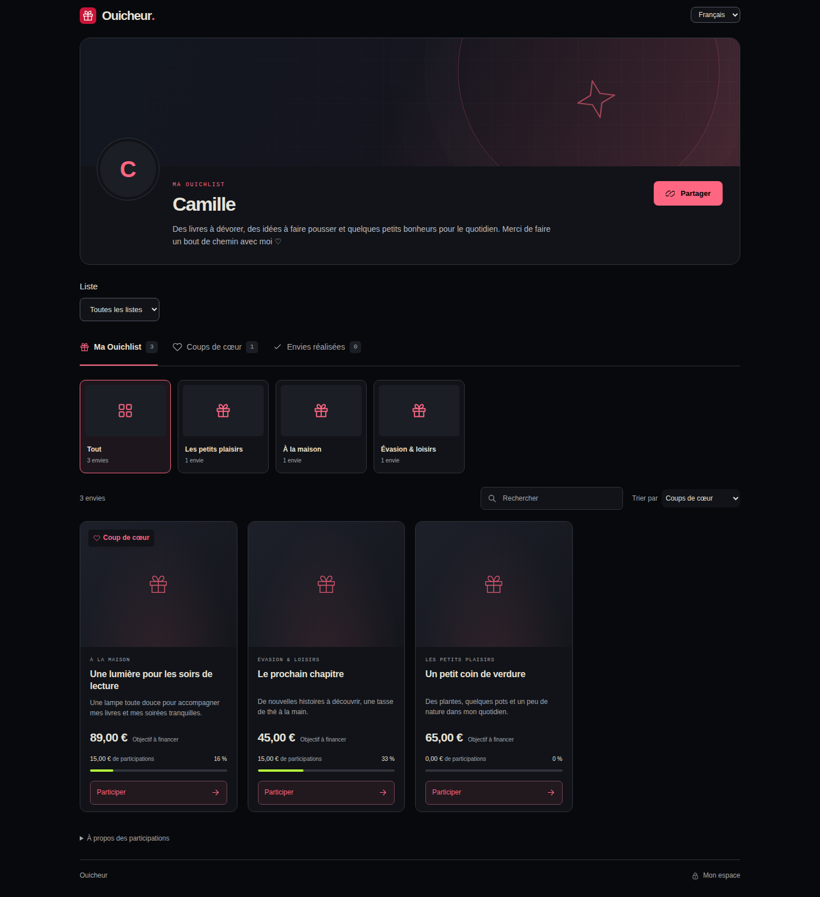

# Ouicheur

[English quick start](README.en.md) · [Nouvelles fonctionnalités et mise à jour](docs/product-features.md) · [Changelog](CHANGELOG.md)

Une Ouichlist personnelle et familiale libre et auto-hébergeable, en anglais par défaut avec une interface française au choix. Un propriétaire peut confier certaines listes à des coorganisateurs avec leur propre compte. Des cadeaux ajoutés par liens, des contributions sans compte visiteur et des versements directs sur son **compte PayPal particulier**.

Le sélecteur **English / Français** est disponible sur toutes les pages, y compris l’installation. Le choix reste mémorisé dans ce navigateur pendant un an. Textes, erreurs, titres, dates et montants suivent cette préférence ; les contenus personnels ne sont pas traduits. Le changement de langue conserve les formulaires en cours. [Localization and upgrade notes](docs/localization.md).

**Par défaut, les participations comptent dès l’envoi déclaré.** Le mode strict optionnel attend la validation du propriétaire. Le propriétaire peut ensuite les valider ou les refuser en un clic. L’application ne commande aucun produit, ne détient pas l’argent et n’ajoute aucune commission. Elle ne promet pas l’absence de frais PayPal.

## Démarrer avec Docker

Prérequis : Docker Engine / Docker Desktop démarré et Docker Compose.

```sh
cp .env.example .env
docker compose up -d --build
```

Sous PowerShell, remplacer la première ligne par `Copy-Item .env.example .env` si `.env` n’existe pas encore. Le fichier `.env` est local et n’est pas versionné.

Ouvrir **http://localhost:3000** : au premier démarrage, un assistant web demande votre pseudonyme, un mot de passe d’au moins 12 caractères, sa confirmation et votre devise. PayPal.Me est facultatif. **Aucun compte ni mot de passe par défaut.**

Un **code d’installation privé** apparaît dans les journaux de l’application (Docker Desktop, TrueNAS, ou `docker compose logs app`). Copier ce code dans l’assistant empêche un premier visiteur public de s’approprier l’instance. Le code persiste jusqu’à la création du propriétaire, puis est supprimé et définitivement désactivé. La connexion à `/admin` est automatique après création du compte. Un redémarrage conserve le compte et ne rouvre pas le setup.

Compléter ensuite le profil, le lien PayPal.Me personnel et les catégories, puis ajouter ou importer les cadeaux. L’instance est volontairement vide ; les données fictives restent dans les tests.

**TrueNAS 25.04 / 25.10 :** voir le [guide d’installation comme application](docs/truenas.md) et le [modèle YAML](compose.truenas.yaml). Le setup s’effectue dans le navigateur ; seule la lecture du code dans les journaux de l’application est nécessaire.

Pour le référencement dans les catalogues **TrueNAS Apps**, **Unraid Community Applications** et les autres plateformes, voir le [parcours de publication](docs/app-catalogs.md).

Les [modèles Unraid](docs/unraid.md) et le [candidat TrueNAS](deploy/truenas/README.md) sont en préparation et ne constituent pas encore une présence dans les catalogues. Voir l’[audit et la feuille de route](docs/review-2026-09-28.md), la [liste de validation de release](docs/release-checklist.md), le [guide de contribution](CONTRIBUTING.md) et les [consignes de sécurité](SECURITY.md).

Le port est lié à `127.0.0.1` pour l’accès local et le reverse proxy. Deux volumes conservent les données et les sauvegardes : `wishlister-data` et `wishlister-backups` (préfixés par Compose). `docker compose down` conserve ces volumes. `down -v` les supprimerait.

## Listes, réservations et maintenance

La nouvelle version propose des listes et événements publics, non répertoriés ou
privés, des liens révocables avec QR code, des réservations sans PayPal, l’ajout
mobile/PWA, une actualisation manuelle des prix et stocks, des sauvegardes complètes
planifiées, des notifications ntfy, un diagnostic et un nettoyage contrôlé.
Le [guide produit](docs/product-features.md) décrit les parcours, leurs limites et
la migration d’une installation existante. Ces changements ne sont disponibles
dans les images publiques qu’après fusion et publication de cette version.



[Vue mobile](docs/screenshots/wishlist-mobile.png) ·
[Réglages et sauvegardes](docs/screenshots/instance-desktop.png).
Ces captures utilisent uniquement des données de démonstration ; une installation
neuve reste vide.

## Personnaliser sa Ouichlist

Dans **Famille et coorganisateurs**, inviter un proche, choisir les listes qu’il
peut préparer et associer des profils adultes ou enfants aux listes. Les profils
ne sont pas publiés automatiquement. Chaque compte gère ses appareils connectés
et son mot de passe dans **Accès et sécurité**. Voir les guides
[famille et droits](docs/family.md) et [sessions et récupération](docs/account-security.md).

Les [idées secrètes](docs/secret-suggestions.md) peuvent être confiées à un
coorganisateur sans être publiées sur la liste. Les [types d’envies](docs/wish-types.md)
couvrent les variantes, les offres de seconde main, les expériences et services
sans lien marchand, avec budget facultatif.

Dans **Mes envies → Gérer les priorités**, renommer les niveaux (y compris « Coup de cœur »), en ajouter et les réordonner. Le niveau marqué d’un cœur est repris dans l’onglet et sur les cartes ; le filtre permet de choisir n’importe quelle priorité. Ces réglages sont communs aux listes de l’instance, conservés dans les sauvegardes et inclus dans l’export JSON. Les envies existantes gardent leur priorité.

Dans **My profile / Mon profil**, choisir l’avatar, la bannière et son cadrage, la présentation, les liens sociaux, une image de fond et la couleur d’accent. Les presets rose, acidulé et menthe reprennent la palette Ouicheur ; le sélecteur de couleur accepte aussi une teinte personnelle. L’aperçu réagit avant l’enregistrement, et la teinte des textes est ajustée pour rester lisible sur fond sombre.

La grille peut être compacte ou aérée. Les catégories deviennent des collections visuelles dont la vignette vient des cadeaux ; les onglets permettent de retrouver toutes les envies, les coups de cœur et les envies réalisées. Les photos, réglages et contenus restent locaux et sont inclus dans les sauvegardes. Les anciens profils conservent leurs contenus et reçoivent le style Ouicheur par défaut.

La disposition s’inspire du [profil présenté par Throne](https://blog.throne.com/the-ultimate-throne-wishlist-setup-checklist-8-steps-to-start-strong/), en conservant les couleurs sombres de Ouicheur et son fonctionnement personnel.

## Développement sans Docker

Node **24 LTS** et npm. Un binaire Node 24 exact est également verrouillé dans les dépendances de développement pour harmoniser les scripts npm, sans modifier Node globalement.

```sh
npm ci
npm run browser:install
cp .env.example .env
npm run dev
```

Production locale : `npm run build`, puis `npm start`. Ces démarrages affichent le code d’installation dans le terminal si le compte n’existe pas encore. Si `.env` est déjà configuré, ne le remplacez pas. Le moteur SQLite intégré à Node est utilisé directement ; il n’y a ni ORM ni serveur de base à administrer. Les migrations SQL de `migrations/` sont appliquées transactionnellement à l’ouverture de la base.

| Commande                                             | Usage                                                               |
| ---------------------------------------------------- | ------------------------------------------------------------------- |
| `npm run dev`                                        | Développement sur localhost:3000                                    |
| `npm run build` / `npm start`                        | Compiler / démarrer en production                                   |
| `npm run setup`                                      | Alternative locale facultative au setup web, une seule fois         |
| `npm run password`                                   | Récupérer l’accès propriétaire et révoquer ses sessions             |
| `npm run check`                                      | Vérifier TypeScript                                                 |
| `npm test`                                           | Tests du registre, sécurité, imports, sauvegarde/restauration       |
| `npm run browser:install`                            | Installer Chromium pour l’import Throne et les tests dans `.local/` |
| `npm run test:fetch-browser`                         | Vérifier le téléchargement Chromium et ses restrictions réseau      |
| `npm run test:e2e`                                   | Parcours navigateur ordinateur + mobile, après compilation          |
| `npm run backup -- chemin/nouveau-dossier`           | Sauvegarde cohérente, utilisable application ouverte                |
| `npm run restore -- sauvegarde nouveau-data-dir`     | Restaurer vers une destination sans base existante                  |
| `npm run probe:imports -- "URL_AMAZON" "URL_THRONE"` | Tester vos liens autorisés, sans contournement                      |

## Utiliser les cadeaux et contributions

Chaque envie accepte une **quantité de 1 à 999**. Le montant saisi est celui d’un exemplaire, livraison comprise ; l’objectif total est **montant unitaire × quantité**. Le total est prévisualisé dans le formulaire et sert au calcul des participations. Les envies existantes conservent leur objectif avec une quantité de 1. Modifier la quantité conserve les contributions déjà reçues.

Pour garder plusieurs envies avec le même lien, cocher **Autoriser un doublon**. À l’import, cette option crée une nouvelle envie indépendante ; **remplacer** modifie l’envie existante et conserve ses contributions et sa devise. Les doublons restent désélectionnés par défaut. Si plusieurs envies correspondent, modifier celle voulue dans **Mes envies** plutôt que choisir un remplacement ambigu.

Le [workflow GitHub Actions](.github/workflows/ci.yml) vérifie les tests, construit et teste l’image Docker, puis la publie sur GHCR. Chacun installe et met à jour son instance avec Docker ou le [guide TrueNAS et Caddy](docs/truenas.md). La CI ne demande aucun accès au serveur de l’utilisateur.

1. Dans **Mes envies**, coller un lien produit et choisir **Récupérer les informations**. Les données Schema.org (JSON-LD, Microdata, RDFa) et Open Graph alimentent un aperçu modifiable. L’image trouvée est téléchargée automatiquement, nettoyée et stockée localement ; elle reste remplaçable par une autre URL ou un fichier. Un échec de l’image conserve les autres informations. L’envie n’est enregistrée qu’après confirmation. Les liens Amazon, Back Market et Chrono24 fournis ont été vérifiés avec titre, prix et image ; [résultats et limites](docs/imports-status.md).
2. Définir un objectif et une catégorie, puis enregistrer : l’envie est immédiatement visible sur la page publique. Les imports publient aussi les envies sélectionnées avec leurs images récupérées automatiquement. L’archivage permet de retirer une envie de la page publique. Le prix extrait est une suggestion datée. Le prix cible peut inclure la livraison et être modifié sans modifier les contributions reçues.
3. Le visiteur choisit son montant. « Continuer vers PayPal » enregistre l’intention et ouvre directement PayPal.Me dans un autre onglet ; la page de suivi reste disponible. Si l’onglet est bloqué, cette page permet d’ouvrir PayPal. Le lien comprend uniquement le nom PayPal.Me, le montant et la devise.
4. Au retour, « J’ai envoyé l’argent » compte immédiatement la participation dans la progression, sans attendre le propriétaire. Le visiteur conserve sa page de suivi privée. La référence aléatoire locale peut aider une discussion avec le propriétaire, mais ne prouve pas le paiement et n’est pas automatiquement transmise à PayPal.
5. Dans **Contributions**, le propriétaire clique sur **Valider** ou **Refuser**. Aucun champ, référence PayPal, case à cocher ou justification n’est demandé. Valider conserve le montant déjà compté ; refuser le retire de la progression. Les filtres **Validées** et **Refusées** permettent de retrouver une participation et de corriger la décision. Le choix est enregistré dans le journal.

Les cadeaux affichent le **total des participations** : envois déclarés ou validés sans versement détaillé enregistré, plus montants reçus restants. Valider conserve le montant annoncé et ne compte jamais deux fois le même envoi. Aucun frais ni référence de transaction n’est inventé. Pour les versements détaillés existants, le net restant remplace la déclaration, ou le brut restant si les frais sont inconnus. Un refus retire la déclaration du total ; les remboursements ajustent le versement détaillé. Les simples intentions, expirations et détections sans déclaration ne comptent pas. Toutes les valeurs en base sont des centimes entiers.

Un dépassement d’objectif est conservé et affiché intégralement. L’objectif atteint, la fermeture manuelle ou l’achat effectif empêchent de nouvelles intentions. Les intentions déjà créées restent rapprochables, même après expiration. Une intention non annoncée expire après sept jours ; aucune contribution historique n’est supprimée.

Un changement de devise de l’instance concerne les nouveaux cadeaux. Les cadeaux existants conservent leur devise et ceux dans une ancienne devise sont fermés aux nouvelles intentions. Le destinataire PayPal.Me est conservé sur chaque intention afin qu’une modification ultérieure du profil n’en change pas le lien.

**Cadeau acheté** est un interrupteur disponible pour le propriétaire sur les cartes de **Mes envies** et sur la fiche du cadeau. L’activer marque le cadeau comme acheté et bloque les nouvelles participations et réservations ; le désactiver annule ce statut sans modifier les sommes reçues ni les réservations existantes. Le mode surprise demande de révéler la liste avant de modifier cet état.

Dans **Plus d’options**, **Mettre cette envie en pause** bloque les nouvelles participations et réservations sans supprimer le cadeau. Les participations déjà commencées peuvent être finalisées. Décocher l’option retire la pause ; les autres conditions de disponibilité restent applicables (achat, objectif atteint, réservation, etc.).

## Corrections, remboursements et journal

Une transaction ne peut confirmer qu’une intention et une intention reçoit au plus une transaction. Deux paiements effectivement distincts nécessitent deux intentions ; si le second arrive après fermeture, conserver son rapprochement hors application jusqu’à disposer d’une intention correspondante : ne jamais fusionner ses références dans une fausse transaction.

Pour corriger un montant, compléter des frais, enregistrer un remboursement ou une annulation confirmée, utiliser **Corriger / rembourser**. Saisir les nouveaux **totaux cumulés**, jamais un delta : brut initial corrigé, frais, total brut remboursé et total net à retirer du financement. Par exemple : 25 € bruts, 1 € de frais, puis 10 € remboursés et 10 € nets retirés donnent 14 € nets restants. Pour un remboursement intégral, le financement du versement doit être nul. Un litige en cours reste une indication distincte et ne retire aucun argent automatiquement.

La révision attendue empêche qu’une ancienne page de correction écrase une opération récente. Les événements sont dédupliqués et chaque confirmation/correction est enregistrée dans le journal. L’origine publique reste « Confirmé par le propriétaire » même lorsque l’administrateur a consulté une source externe.

## Imports Amazon, Throne et fichiers

**Statuts distincts, sans succès d’intégration externe inventé :**

| Source     | Implémentation V1                                                                             | Validation                                                                                                 |
| ---------- | --------------------------------------------------------------------------------------------- | ---------------------------------------------------------------------------------------------------------- |
| Amazon     | Import par URL avec pagination publique, identifiants ASIN, prix EUR et images                | Liste réelle `21JDMRZC1ARHC` : 20 articles sur deux pages, 20 images et réimport vérifiés sur Docker Linux |
| Throne     | Import automatique par URL, HTML public (Next.js / JSON-LD), transport Chromium si nécessaire | `claw61` vérifié sur Windows et Docker Linux : 11 cadeaux, 2 doublons de lien signalés                     |
| CSV / JSON | Format commun, aperçu, sélection, édition et dédoublonnage                                    | Tests locaux exécutés ; exemples fournis                                                                   |

Le client partagé négocie HTTP/2 ou HTTP/1.1 et privilégie une adresse IPv4 publique lorsqu’elle existe. Pour les listes comme pour les fiches produit, un refus 403/429 ou une connexion interrompue déclenche automatiquement une lecture du document par Chromium côté serveur, dans une session neuve, sans scripts ni ressources annexes. Chromium est inclus dans l’image Docker ; hors Docker, l’installer avec `npm run browser:install`. Chaque changement d’origine repasse par la validation DNS avant connexion. Les adresses privées, documents trop volumineux et délais excessifs restent refusés. L’import ne se connecte pas aux comptes et n’appelle aucune API privée.

**Importer Throne :** choisir **Liste Throne — profil public**, coller le lien et préparer l’aperçu. Les produits et variantes sont identifiés dans la liste, puis leurs prix et images sont récupérés chez les marchands. Aucun prix, frais ou montant financé de Throne n’est repris. Les prix marchands étrangers sont automatiquement convertis dans la devise du profil avec les taux de référence de la BCE ; l’objectif est prérempli et la date du taux reste visible. Les liens répétés sont désélectionnés par défaut. L’option de page HTML enregistrée reste disponible séparément.

Les travaux et aperçus sont persistés en SQLite. Une tâche interrompue peut être reprise depuis l’administration après expiration du verrou de 30 secondes, avec trois prises de tâche au maximum. Une erreur explicite demande de créer un nouvel import après résolution du problème ; il n’y a pas de boucle de requêtes ni de synchronisation permanente.

Les exemples [CSV](public/examples/import.csv) et [JSON](public/examples/import.json) contiennent : `source_id`, `url`, `title`, `description`, `image_url`, `price`, `currency`. Prix décimal sous forme de texte, 200 éléments / 900 Ko maximum, CSV UTF-8 avec en-tête et séparateur virgule. Les champs inconnus sont ignorés. Aucune adresse personnelle, donnée de contributeur ni ancien financement n’est importé. La conversion automatique est affichée dans l’aperçu avec son montant d’origine et la date du taux.

Une URL marchande manquante reste signalée avant publication. Réimporter ne remplace pas vos modifications sans choix explicite. La validation finale est atomique : un conflit annule l’enregistrement du lot et conserve son aperçu. Voir [l’état détaillé des importateurs](docs/imports-status.md).

## Sauvegarder et restaurer

```sh
# Docker, application en fonctionnement :
docker compose exec app npm run backup -- /app/backups/ma-sauvegarde
# Exporter le dossier hors du serveur / volume Docker :
docker compose cp app:/app/backups/ma-sauvegarde ./ma-sauvegarde
```

La sauvegarde utilise **SQLite `VACUUM INTO`**, qui produit un instantané cohérent des données validées, y compris celles du journal WAL. Elle ouvre ensuite cet instantané et copie les images qu’il référence. Les images adressées par contenu sont immuables : une modification concurrente ne remplace pas leur contenu. Ne copiez pas seulement `wishlist.sqlite` à chaud.

Le dossier contient la base, les images référencées et `manifest.json` : version, empreintes SHA-256 et configuration `APP_ORIGIN` / `TRUST_PROXY`. Il contient aussi le hachage d’accès du propriétaire et les messages privés ; conservez-le dans un emplacement privé. Le logiciel n’a aucun secret API à sauvegarder. Les paramètres de votre reverse proxy restent à sauvegarder à part.

Restaurer sur une **nouvelle instance arrêtée ou non initialisée**, dans un volume vide :

```sh
docker compose stop app
# Adapter le chemin de montage au dossier de sauvegarde local :
docker compose run --rm -v ./ma-sauvegarde:/restore:ro app npm run restore -- /restore /app/data
docker compose up -d
```

La restauration refuse toute base existante. Elle vérifie les noms de fichiers, leurs empreintes et `PRAGMA integrity_check`, puis copie la base et les images. Toutes les sessions restaurées sont révoquées. Reporter les valeurs utiles de `data/restored-config.json` dans `.env`, adapter `APP_ORIGIN` au nouveau domaine, et se reconnecter avec le mot de passe sauvegardé ou lancer la récupération locale.

Pour une installation sans Docker : `npm run restore -- ./ma-sauvegarde ./nouveau-data`, puis configurer `DATA_DIR=./nouveau-data`. La restauration et le redémarrage d’une connexion SQLite sont testés automatiquement ; voir [les vérifications de livraison](docs/verification.md).

## Domaine et HTTPS

Publier seulement après avoir choisi le domaine et configuré le propriétaire. Pointer le domaine vers votre serveur. Conserver le port 3000 sur l’interface locale et placer un reverse proxy HTTPS devant. Exemple Caddy installé sur le même serveur :

```caddyfile
envies.example.org {
    reverse_proxy 127.0.0.1:3000
}
```

Configurer `APP_ORIGIN=https://envies.example.org`, puis recréer le conteneur avec `docker compose up -d`. Cette origine publique reste acceptée derrière un reverse proxy, même si celui-ci réécrit l’adresse interne.

Pour les tests et l’accès direct, `localhost`, `127.0.0.1`, l’adresse du NAS ou son nom local fonctionnent aussi sans changer `APP_ORIGIN` : chaque requête doit venir du même protocole, hôte et port que l’adresse ouverte dans le navigateur. Le contrôle compare `Origin` à `Host`, selon la [recommandation OWASP](https://cheatsheetseries.owasp.org/cheatsheets/Cross-Site_Request_Forgery_Prevention_Cheat_Sheet.html#identifying-the-target-origin), et ne se fie pas à `X-Forwarded-Host`. Les origines absentes, invalides ou étrangères sont refusées, et JSON reste obligatoire. Cela ne change pas les interfaces réseau sur lesquelles le serveur écoute.

Les cookies portent `Secure` lorsque la connexion utilise une origine HTTPS validée ; une connexion HTTP locale reste possible même si `APP_ORIGIN` indique le domaine public HTTPS. Ils sont toujours `HttpOnly` et `SameSite=Strict`, avec expiration à douze heures. Chaque adresse conserve sa propre session : changer d’hôte demande de se reconnecter, sans refaire le setup.

`TRUST_PROXY=1` ne doit être activé que si le proxy de confiance remplace réellement `X-Forwarded-For`, et qu’un client ne peut pas contourner ce proxy. Sinon la limitation utilise un quota partagé. Les valeurs par défaut sont 10 tentatives de connexion / 15 minutes, 30 intentions / heure par adresse de confiance ou quota partagé, 300 intentions / heure sur l’instance, et des limites supplémentaires sur extraction/imports/images.

La V1 n’a aucun listener de paiement ni besoin d’accès entrant PayPal spécifique. Seul le trafic web habituel entre par le reverse proxy. Aucun service SaaS central, envoi d’e-mails payant ou compte professionnel n’est nécessaire. Les polices, scripts et images affichés restent locaux ; aucune télémétrie applicative ni suivi publicitaire.

## Sécurité et architecture

Monolithe Next.js / React / TypeScript, SQLite Node, images WebP locales. Les domaines sont dans `lib/` : `auth`, `gifts`, `payments`, `imports`, `metadata`, `fetch-safe`, `images`, `backup`. Les routes contrôlent les sessions et l’origine avant les écritures ; les extractions réseau sont réservées à l’administrateur. Mots de passe scrypt, sel aléatoire, sessions aléatoires dont seul le hachage est stocké.

L’initialisation web exige un code aléatoire de 192 bits généré au démarrage et conservé dans le stockage privé jusqu’à utilisation. Il n’est jamais renvoyé par HTTP. `/api/setup` vérifie l’origine, limite les essais à 10 par 15 minutes sur l’instance et borne le corps à 16 Ko. La création du propriétaire et la suppression du code sont atomiques, y compris en cas de requêtes concurrentes. Une instance déjà configurée refuse toute nouvelle initialisation.

Le téléchargement refuse les protocoles non HTTP(S), les identifiants dans les URLs, les ports inattendus, les IP privées/réservées IPv4 et IPv6 et les résolutions DNS mixtes. Il fixe l’IP validée pour la connexion, revalide chaque redirection et impose trois redirections / 15 secondes / 8 Mo HTML / 5 Mo image. Les images raster sont décodées avec une limite de pixels, réencodées et débarrassées de leurs métadonnées ; SVG refusé. Les textes sont échappés par React, le HTML externe n’est jamais rendu ni exécuté.

Le journal et les contributions sont conservés. L’écran affiche les 1 000 dernières intentions, les 50 derniers imports et les 100 dernières opérations ; l’export contient le registre et le journal complets. Cette limite de vue convient à la V1 personnelle ; prévoir une pagination avant un usage dépassant ces volumes.

Le point d’évolution des paiements est le registre `lib/payments.ts` et ses tables transaction/événements. Aucun endpoint n’accepte une provenance « vérifiée » fournie par un visiteur. Un futur adaptateur devra démontrer authenticité, destinataire, statut, montants, devise et association certaine avant d’écrire un événement vérifié. [Étude PayPal](docs/payments-feasibility.md).

## Vérification et licence

```sh
npm run check
npm test
npm run build
npm run browser:install
npm run test:e2e
```

Les tests navigateur utilisent le port 3211 pour les parcours courants et une instance vide sur le port 3213 pour chaque scénario de setup. Les données restent dans `.local/e2e/` et `.local/e2e-setup/`. Ils n’ouvrent jamais PayPal et n’effectuent aucun paiement. Les captures sont dans `test-results/` et le rapport dans `playwright-report/`, tous ignorés par Git. [Détail des vérifications et limites](docs/verification.md).

Documentation technique consultée : [installation Next.js](https://nextjs.org/docs/app/getting-started/installation), [déploiement standalone](https://nextjs.org/docs/app/api-reference/config/next-config-js/output), [SQLite Node](https://nodejs.org/api/sqlite.html), [scrypt Node](https://nodejs.org/docs/latest-v24.x/api/crypto.html), [Cheerio](https://cheerio.js.org/docs/basics/loading/), [réencodage Sharp](https://sharp.pixelplumbing.com/api-output/).

Licence [MIT](LICENSE). Code public : [hloiseau/ouicheur](https://github.com/hloiseau/ouicheur).
